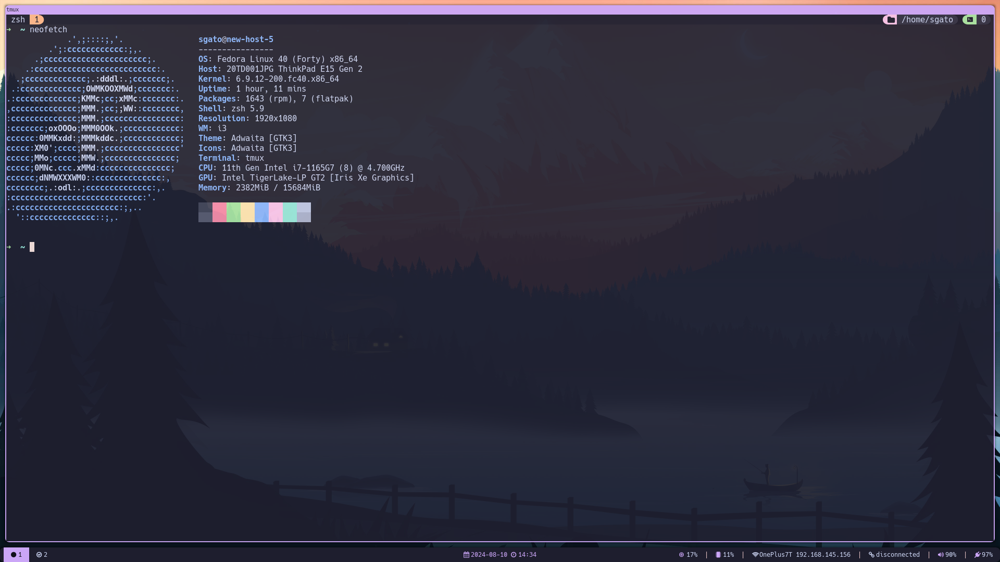

# Dotfiles
My 2024 dotfiles (originally made for Fedora 40 i3 spin)



## Install dependencies temporarily
1. For installing zsh, neovim, polybar, git:
```sh
sudo dnf -y install neovim xclip polybar zsh gcc make git ripgrep fd-find unzip ne alacritty flameshot fontawesome-fonts neofetch blueman rofi tmux
```

## Tools and Installation

The installation and soft linking assume that the dotfiles are cloned in the home directory. In the future, a script will be made to automate the process.

### Git

### I3

### Polybar

### Nvim

### Flameshot

### Rofi

### Zsh

### Alacritty

### Picom

### Betterlockscreen

### Tmux
1. Install tmux:
```sh
sudo dnf install tmux
```

2. Install tmux plugin manager:
```sh
git clone https://github.com/tmux-plugins/tpm ~/.tmux/plugins/tpm
```

3. Link tmux config:
```sh
ln -s $HOME/Dotfiles/tmux/tmux.conf $HOME/.tmux.conf
```

### Blueman

## TODO
- [ ] i3
    - [x] wallpapers
    - [x] binds for discord, brave, flameshot
- [ ] polybar
- [ ] nvim
- [x] flameshot
- [x] rofi
- [ ] zsh
- [ ] alacritty
- [ ] picom
- [ ] betterlockscreen
- [ ] tmux
- [ ] improve README
